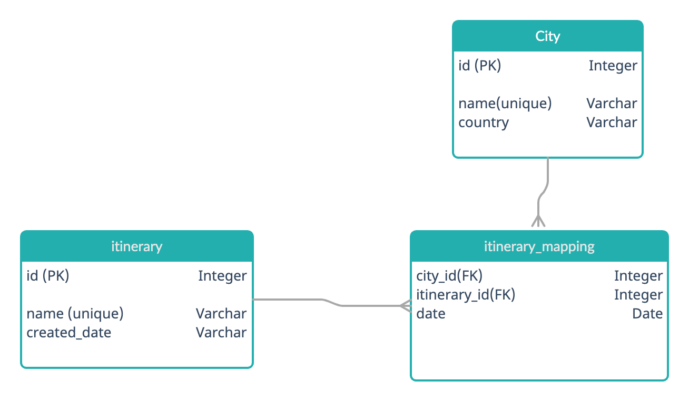
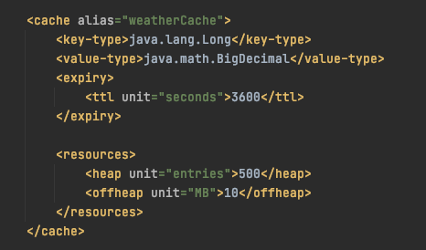
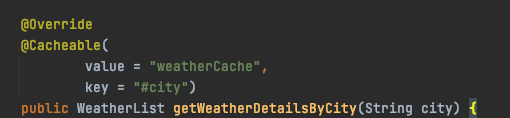
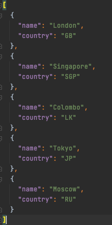

# travel-planner
## _Backend service of travel planner application_
### _Entity diagram_

### _How to run_
- clone the source code or download
- go to the downloaded folder
- run ./mvnw spring-boot:run

### _Cache configuration_
- Get weather API calls are cashed using ehcache and spring cache (src/main/resources/ehcache.xml).
- Expiration is configured to 1 hour
  
  

### _Database configuration_

- H2 is used with Hikari connection pool

### _Meta data_

- To implement itinerary save screen, to populate the city dropdown, 
  there is a xml file containing cities all cities.
  (src/main/resources/city_list.json)

  

### _Verify the installation_
- [Swagger UI link](http://localhost:8080/swagger-ui/#) 